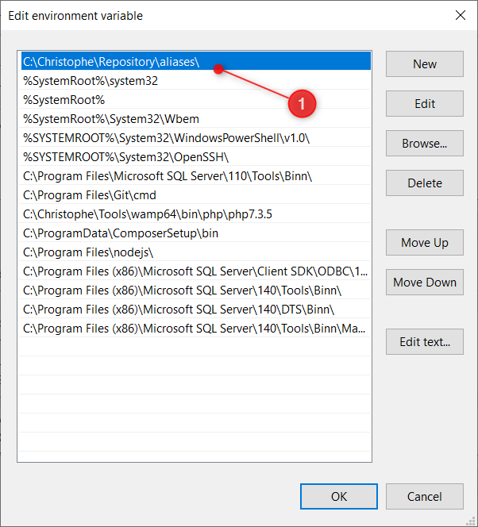
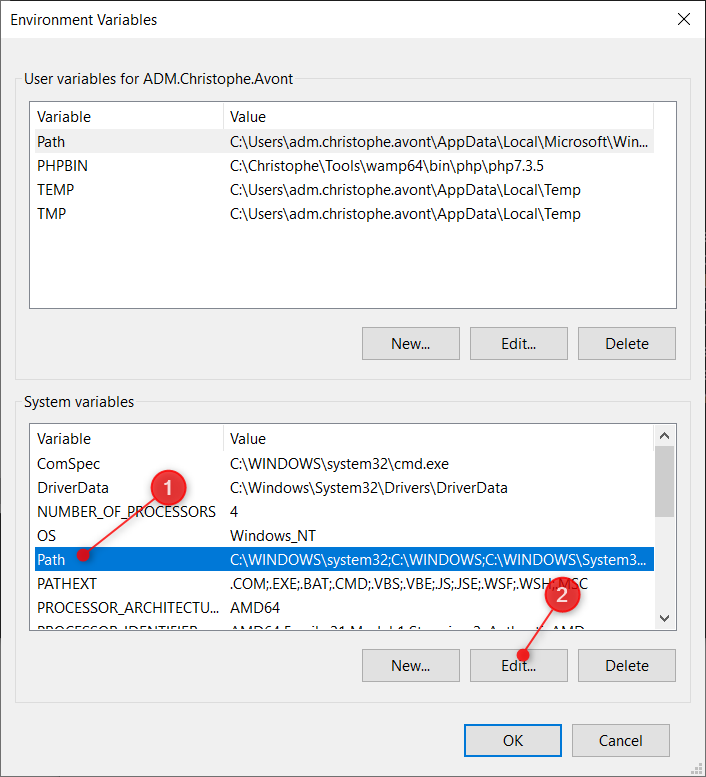

<!-- This file has been generated by the concat-md.ps1 script. -->
<!-- Don't modify this file manually (you'll loose your changes) -->
<!-- but run the tool once more -->

<!-- Last refresh date: 2020-12-07 22:13:16 -->

<!-- below, content of ./index.md -->

# Bash tips


<!-- table-of-contents - start -->
* [Bash on ms-dos](#bash-on-ms-dos)
  * [Run bash from Windows 10](#run-bash-from-windows-10)
    * [Add an alias](#add-an-alias)
    * [Possible problems](#possible-problems)
* [Bash with git bash](#bash-with-git-bash)
* [XML processing](#xml-processing)
  * [Extract the value of a node](#extract-the-value-of-a-node)
* [Get the value of a node (return TEST for <project-name>TEST<project-name>)](#get-the-value-of-a-node-return-test-for-<project-name>test<project-name>)
* [Display the project name and, on a second line, a line with "======="](#display-the-project-name-and-on-a-second-line-a-line-with-=======)
  * [Get the list of elements](#get-the-list-of-elements)
* [https://unix.stackexchange.com/a/553142](#https:unixstackexchangecoma553142)
* [Get the list of <package> nodes but only those with enabled=1 attribute](#get-the-list-of-<package>-nodes-but-only-those-with-enabled=1-attribute)
* [Extract the name attribute of these nodes](#extract-the-name-attribute-of-these-nodes)
* [Then process them one by one](#then-process-them-one-by-one)
<!-- table-of-contents - end -->

<!-- below, content of ./dos/readme.md -->

## Bash on ms-dos

<!-- below, content of ./dos/windows_10/readme.md -->

### Run bash from Windows 10

If you get trouble by running `bash` from a command prompt, specify the full path like this:

```bash
"C:\Program Files\Git\bin\bash.exe" yourscript.sh
```

It should works now.

#### Add an alias

Don't want to specify each time the full path? Just create an alias.

Edit your system variables by running the `Edit system environment variables` program (i.e. click on the `Start` button then start to type `Edit system...`).

Click on the `Path` in the **system variable** area (see screen capture below).


Add a new folder at the very first position. *I've chosen to create such folder: `C:\Christophe\Repository\aliases\` on my side.*



**Note: make sure the alias folder is at the first position to have the priority to any other command having the same name.**

Go now to your aliases folder and add a new file called `bash.cmd` and edit the file. Type the following content:

```bash
@echo off
REM cls  -- Don't clear the screen, need to keep it for batch operations
REM And make sure to return the exit code
"C:\Program Files\Git\bin\bash.exe" %*

set errorcode=%ERRORLEVEL%

IF %errorcode% NEQ 0 (
    echo     [31mERROR - The bash script has returned an error %errorcode%[0m
    echo     [31mThe command line was:[0m
    echo.
    echo     [31m"C:\Program Files\Git\bin\bash.exe" %*[0m
    echo.
)

EXIT /B %errorcode
```

Since you've modified your `PATH` variable, close any command prompt screen and start a new one.

Now, by just typing `bash` it should works.

#### Possible problems

By just running `bash` from the command prompt, you can get this error:

```text
Windows Subsystem for Linux has no installed distributions.
Distributions can be installed by visiting the Microsoft Store:
https://aka.ms/wslstore
```

Note: the default `bash` interpreter is located in the `C:\Windows\System32\` folder

<!-- below, content of ./git/readme.md -->

## Bash with git bash

If you want to use git bash, you must follow these steps:

* Download [Git for Windows](https://gitforwindows.org)
* Install it.
* Execute this command in your power shell console as an administrator:

```bash
$files = (Get-ChildItem 'C:\Program Files\Git\usr\bin\*.exe').FullName

$files.ForEach({Set-ProcessMitigation $_ -Disable ForceRelocateImages})
```

* Edit your system variables by running the `Edit system environment variables` program (i.e. click on the `Start` button then start to type `Edit system...`).
* Click on the `Path` in the **system variable** area (see screen capture below).

    

* Move the git command folder before system32
* Execute git as an administrator

<!-- below, content of ./xml/readme.md -->

## XML processing

Consider the following file:

```xml
<config>
    <project-name>Test project</project-name>
    <packages>
        <package name="git" enabled="1" />
        <package name="xdebug" enabled="0" />
        <package name="postgres" enabled="1" />
    </packages>
</config>
```

### Extract the value of a node

Extract the value of the `project-name` node and display it

```bash
config="sample.xml"

## Get the value of a node (return TEST for <project-name>TEST<project-name>)
projectName=$(grep -oP "(?<=<project-name>)[^<]+" $config)
## Display the project name and, on a second line, a line with "======="
echo -e "${projectName}\n${projectName//?/=}\n"
```

This sample will display:

```text
Test project
============
```

### Get the list of elements

Retrieve the list of elements in a XML file; limit the list based on the value of an attribute and return the value of a second attribute:

```bash
## https://unix.stackexchange.com/a/553142
## Get the list of <package> nodes but only those with enabled=1 attribute
## Extract the name attribute of these nodes
## Then process them one by one
packages=$(cat $config | tr -d '\n'| grep -Eo "<package[>\ ][^<]+enabled=\"1\"[^>]+." | grep -oP "(?<=name\=\")[^\"]*")

for package in $packages; do
    printf "Process '$package'\n"
done
```

This sample will display:

```text
Process 'git'
Process 'postgres'
```
